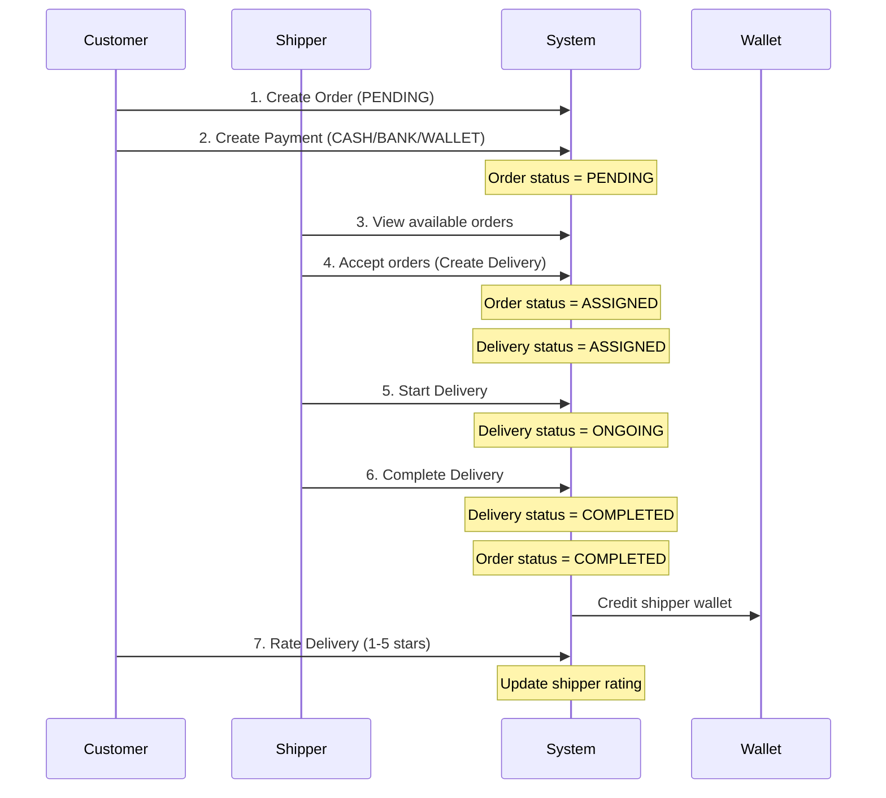
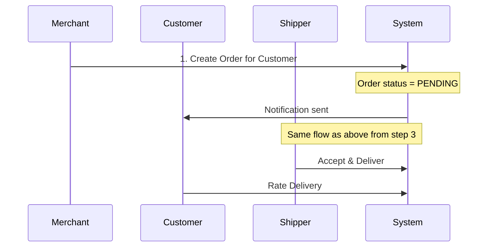

# 🔄 Complete Workflow Guide - FastShip Delivery System

## 📋 Mục lục
1. [Tổng quan hệ thống](#tổng-quan-hệ-thống)
2. [Flow hoàn chỉnh từ đầu đến cuối](#flow-hoàn-chỉnh)
3. [Backend APIs Summary](#backend-apis-summary)
4. [Testing Scenarios](#testing-scenarios)
5. [Troubleshooting](#troubleshooting)

---

## 🎯 Tổng quan hệ thống

### Roles (Vai trò):
1. **Customer** - Người đặt hàng
2. **Shipper** - Người giao hàng
3. **Merchant** - Người bán/shop
4. **Admin** - Quản trị viên

### Database Schema:
```
app.roles
app.users
app.orders
app.deliveries
app.payments
app.shipper_wallets
app.shipper_wallet_transactions
app.ratings
app.notifications
app.tracking_events
```

---

## 🔄 Flow hoàn chỉnh

### Flow 1: Customer tự tạo order (Standard Flow)



### Các bước chi tiết:

#### **Bước 1: Customer tạo đơn hàng**
- **Action:** Click "Create New Order" button
- **API:** `POST /orders`
- **Request Body:**
```json
{
  "pickup_address": "123 Nguyen Hue, Dist 1",
  "delivery_address": "456 Le Loi, Dist 3",
  "distance_km": 5.5,
  "price_estimate": 35000
}
```
- **Response:**
```json
{
  "ok": true,
  "order": {
    "order_id": 1,
    "customer_id": 4,
    "status": "PENDING",
    "created_at": "2025-10-31T00:00:00"
  }
}
```
- **Frontend:** Order xuất hiện trong danh sách với status "PENDING"

---

#### **Bước 2: Customer thanh toán**
- **Action:** Click "Pay" button trên order PENDING
- **API:** `POST /payments/{order_id}`
- **Request Body:**
```json
{
  "amount": 35000,
  "method": "CASH",  // or "BANK", "WALLET"
  "transaction_ref": ""
}
```
- **Response:**
```json
{
  "ok": true,
  "payment": {
    "payment_id": 1,
    "order_id": 1,
    "status": "PENDING",  // PENDING for CASH, SUCCESS for BANK/WALLET
    "method": "CASH"
  }
}
```
- **Notification:** Customer nhận thông báo thanh toán

---

#### **Bước 3: Shipper xem đơn hàng available**
- **Action:** Shipper login → Tab "Available Orders"
- **API:** `GET /deliveries/available`
- **Response:**
```json
{
  "ok": true,
  "orders": [
    {
      "order_id": 1,
      "pickup_address": "123 Nguyen Hue, Dist 1",
      "delivery_address": "456 Le Loi, Dist 3",
      "price_estimate": 35000,
      "distance_km": 5.5,
      "status": "PENDING"
    }
  ]
}
```
- **Frontend:** Hiển thị danh sách orders có thể nhận

---

#### **Bước 4: Shipper nhận đơn hàng**
- **Action:** Select orders → Click "Accept Orders"
- **API:** `POST /deliveries`
- **Request Body:**
```json
{
  "order_ids": [1, 2, 3],
  "max_capacity": 3
}
```
- **Response:**
```json
{
  "ok": true,
  "delivery": {
    "delivery_id": 1,
    "shipper_id": 3,
    "status": "ASSIGNED",
    "max_capacity": 3
  }
}
```
- **Side Effects:**
  - Order status → ASSIGNED
  - Order.delivery_id → 1
  - Tracking event created: "Delivery created by shipper"
- **Frontend:** Orders biến mất khỏi "Available", xuất hiện trong "My Deliveries"

---

#### **Bước 5: Shipper bắt đầu giao hàng**
- **Action:** Click "Start Delivery" trong "My Deliveries"
- **API:** `PUT /deliveries/{delivery_id}/status`
- **Request Body:**
```json
{
  "status": "ONGOING",
  "note": "On the way to pickup",
  "lat": 10.762622,
  "lng": 106.660172
}
```
- **Response:**
```json
{
  "ok": true,
  "delivery": {
    "delivery_id": 1,
    "status": "ONGOING",
    "updated_at": "2025-10-31T01:00:00"
  }
}
```
- **Side Effects:**
  - Delivery status → ONGOING
  - Tracking event created with location
  - Notifications sent to customers
- **Frontend:** Button đổi thành "Complete Delivery"

---

#### **Bước 6: Shipper hoàn thành giao hàng**
- **Action:** Click "Complete Delivery"
- **API:** `PUT /deliveries/{delivery_id}/status`
- **Request Body:**
```json
{
  "status": "COMPLETED",
  "note": "Delivered successfully"
}
```
- **Response:**
```json
{
  "ok": true,
  "delivery": {
    "delivery_id": 1,
    "status": "COMPLETED",
    "delivered_at": "2025-10-31T02:00:00"
  }
}
```
- **Side Effects:**
  1. Delivery status → COMPLETED
  2. All orders in delivery → COMPLETED
  3. CASH payments → SUCCESS
  4. **Shipper wallet credited:**
     - Balance += total_earning (sum of all order prices)
     - Transaction log created
  5. Tracking event created
  6. Notifications sent to all customers
- **Frontend:** 
  - Shipper: Wallet balance updated
  - Customer: Order status → COMPLETED, "Rate" button active

---

#### **Bước 7: Customer đánh giá**
- **Action:** Click "Rate" button trên order COMPLETED
- **API:** `POST /ratings/{delivery_id}`
- **Request Body:**
```json
{
  "score": 5,
  "comment": "Excellent service!"
}
```
- **Response:**
```json
{
  "ok": true,
  "rating": {
    "rating_id": 1,
    "delivery_id": 1,
    "customer_id": 4,
    "shipper_id": 3,
    "score": 5,
    "comment": "Excellent service!"
  }
}
```
- **Side Effects:**
  - Shipper profile rating updated:
    - rating_count += 1
    - rating_avg = (old_avg * old_count + new_score) / (old_count + 1)
- **Frontend:** Alert "Thank you for your feedback!"

---

### Flow 2: Merchant tạo order cho customer



#### **Merchant tạo order:**
- **API:** `POST /merchant/orders`
- **Request Body:**
```json
{
  "customer_id": 4,
  "pickup_address": "My Shop, 123 Street",
  "delivery_address": "Customer address",
  "distance_km": 3.5,
  "price_estimate": 25000
}
```

---

## 📡 Backend APIs Summary

### 🔐 Authentication (`/auth`)
| Method | Endpoint | Description | Auth Required |
|--------|----------|-------------|---------------|
| POST | `/auth/register` | Đăng ký user mới | ❌ |
| POST | `/auth/login` | Đăng nhập | ❌ |
| POST | `/auth/logout` | Đăng xuất | ✅ |
| GET | `/auth/me` | Lấy thông tin user hiện tại | ✅ |
| POST | `/auth/firebase` | Đăng nhập qua Firebase | ❌ |

### 📦 Orders (`/orders`)
| Method | Endpoint | Description | Auth Required | Role |
|--------|----------|-------------|---------------|------|
| POST | `/orders` | Tạo order mới | ✅ | Customer |
| GET | `/orders` | Lấy orders của customer | ✅ | Customer |
| POST | `/orders/{id}/cancel` | Hủy order | ✅ | Customer/Admin |

### 🚚 Deliveries (`/deliveries`)
| Method | Endpoint | Description | Auth Required | Role |
|--------|----------|-------------|---------------|------|
| GET | `/deliveries/available` | Xem orders khả dụng | ✅ | Shipper |
| POST | `/deliveries` | Nhận orders (tạo delivery) | ✅ | Shipper |
| PUT | `/deliveries/{id}/status` | Cập nhật trạng thái | ✅ | Shipper |
| GET | `/deliveries/my` | Xem deliveries của shipper | ✅ | Shipper |
| GET | `/deliveries/{id}/tracking` | Xem tracking events | ✅ | Any |

### 💳 Payments (`/payments`)
| Method | Endpoint | Description | Auth Required | Role |
|--------|----------|-------------|---------------|------|
| POST | `/payments/{order_id}` | Tạo payment | ✅ | Customer |
| GET | `/payments/{order_id}` | Xem payment | ✅ | Customer |
| POST | `/payments/{order_id}/refund` | Hoàn tiền | ✅ | Admin |

### 👛 Wallet (`/wallet`)
| Method | Endpoint | Description | Auth Required | Role |
|--------|----------|-------------|---------------|------|
| GET | `/wallet` | Xem số dư | ✅ | Shipper |
| GET | `/wallet/transactions` | Xem lịch sử giao dịch | ✅ | Shipper |

### ⭐ Ratings (`/ratings`)
| Method | Endpoint | Description | Auth Required | Role |
|--------|----------|-------------|---------------|------|
| POST | `/ratings/{delivery_id}` | Đánh giá delivery | ✅ | Customer |
| GET | `/ratings/shipper/{id}` | Xem ratings của shipper | ✅ | Any |
| GET | `/ratings/delivery/{id}` | Xem rating của delivery | ✅ | Any |

### 🔔 Notifications (`/notifications`)
| Method | Endpoint | Description | Auth Required | Role |
|--------|----------|-------------|---------------|------|
| GET | `/notifications` | Lấy thông báo | ✅ | Any |
| PUT | `/notifications/{id}/read` | Đánh dấu đã đọc | ✅ | Any |
| DELETE | `/notifications/clear-read` | Xóa thông báo đã đọc | ✅ | Any |

### 🏪 Merchant (`/merchant`)
| Method | Endpoint | Description | Auth Required | Role |
|--------|----------|-------------|---------------|------|
| POST | `/merchant/orders` | Tạo order cho customer | ✅ | Merchant |
| GET | `/merchant/orders` | Xem orders của merchant | ✅ | Merchant |
| GET | `/merchant/deliveries` | Xem deliveries | ✅ | Merchant |
| GET | `/merchant/payments` | Xem payments | ✅ | Merchant |

### 👑 Admin (`/admin`)
| Method | Endpoint | Description | Auth Required | Role |
|--------|----------|-------------|---------------|------|
| GET | `/admin/summary` | Dashboard statistics | ✅ | Admin |
| GET | `/admin/users` | Lấy tất cả users | ✅ | Admin |
| GET | `/admin/orders` | Lấy tất cả orders | ✅ | Admin |
| GET | `/admin/deliveries` | Lấy tất cả deliveries | ✅ | Admin |
| POST | `/admin/payments/{id}/refund` | Force refund | ✅ | Admin |

---

## 🧪 Testing Scenarios

### Scenario 1: End-to-End Order Flow

**Setup:**
- Customer: customer1 / customer123
- Shipper: shipper1 / shipper123

**Steps:**

1. **Login as Customer**
```bash
POST http://localhost:5000/auth/login
{
  "username": "customer1",
  "password": "customer123"
}
```
Save token: `eyJ0eXAiOiJKV1QiLCJhbGc...`

2. **Create Order**
```bash
POST http://localhost:5000/orders
Authorization: Bearer <customer_token>
{
  "pickup_address": "123 Nguyen Hue, District 1",
  "delivery_address": "456 Le Loi, District 3",
  "distance_km": 5.5,
  "price_estimate": 35000
}
```
✅ Expected: `{ "ok": true, "order": { "order_id": X } }`

3. **Create Payment**
```bash
POST http://localhost:5000/payments/{order_id}
Authorization: Bearer <customer_token>
{
  "amount": 35000,
  "method": "CASH"
}
```
✅ Expected: `{ "ok": true, "payment": { "status": "PENDING" } }`

4. **Login as Shipper**
```bash
POST http://localhost:5000/auth/login
{
  "username": "shipper1",
  "password": "shipper123"
}
```

5. **View Available Orders**
```bash
GET http://localhost:5000/deliveries/available
Authorization: Bearer <shipper_token>
```
✅ Expected: Order vừa tạo có trong list

6. **Accept Order**
```bash
POST http://localhost:5000/deliveries
Authorization: Bearer <shipper_token>
{
  "order_ids": [X],
  "max_capacity": 1
}
```
✅ Expected: `{ "ok": true, "delivery": { "delivery_id": Y } }`

7. **Start Delivery**
```bash
PUT http://localhost:5000/deliveries/{delivery_id}/status
Authorization: Bearer <shipper_token>
{
  "status": "ONGOING"
}
```
✅ Expected: Status updated

8. **Complete Delivery**
```bash
PUT http://localhost:5000/deliveries/{delivery_id}/status
Authorization: Bearer <shipper_token>
{
  "status": "COMPLETED"
}
```
✅ Expected:
- Delivery COMPLETED
- Order COMPLETED
- Wallet credited

9. **Check Wallet**
```bash
GET http://localhost:5000/wallet
Authorization: Bearer <shipper_token>
```
✅ Expected: Balance increased by 35000

10. **Rate Delivery (as Customer)**
```bash
POST http://localhost:5000/ratings/{delivery_id}
Authorization: Bearer <customer_token>
{
  "score": 5,
  "comment": "Great service!"
}
```
✅ Expected: Rating created

---

### Scenario 2: Multiple Orders Batch Delivery

1. Customer tạo 3 orders
2. Shipper nhận cả 3 orders cùng lúc
3. Complete → Wallet nhận tổng tiền 3 orders

---

### Scenario 3: Cancel Order

1. Customer tạo order
2. Customer cancel order (trước khi shipper accept)
3. ✅ Order status → CANCELED
4. Shipper không thấy order này nữa

---

## 🐛 Troubleshooting

### Issue: "Connection refused"
**Cause:** Database không chạy  
**Fix:**
```bash
docker ps  # Check if postgres is running
docker start my-postgres
```

### Issue: "Token expired"
**Cause:** JWT token hết hạn  
**Fix:** Login lại để lấy token mới

### Issue: "Order not found"
**Cause:** Order ID không tồn tại  
**Fix:** Kiểm tra `GET /orders` để xem order_id có sẵn

### Issue: "Forbidden"
**Cause:** Role không có quyền  
**Fix:** Đảm bảo dùng đúng role (customer cho `/orders`, shipper cho `/deliveries`)

### Issue: "Wallet not found"
**Cause:** Shipper chưa có wallet  
**Fix:** Run `seed_data.py` để tạo wallets

---

## ✅ Checklist Đảm bảo hệ thống hoạt động

### Backend:
- [ ] PostgreSQL đang chạy (port 5432)
- [ ] `python app.py` không có error
- [ ] `python seed_data.py` đã chạy thành công
- [ ] Test users đã được tạo
- [ ] Tất cả tables đã được tạo trong schema `app`

### Frontend:
- [ ] `npm run dev` đang chạy (port 5173)
- [ ] `.env` file có `VITE_API_URL=http://localhost:5000`
- [ ] Login thành công với test accounts
- [ ] Customer dashboard hiển thị orders
- [ ] Shipper dashboard hiển thị available orders
- [ ] Modal components hoạt động

### Integration:
- [ ] Customer tạo order → Order xuất hiện trong list
- [ ] Customer thanh toán → Payment được tạo
- [ ] Shipper xem available orders → Thấy orders của customer
- [ ] Shipper accept orders → Delivery được tạo
- [ ] Shipper complete → Wallet được cập nhật
- [ ] Customer rate → Rating được lưu

---

## 🎯 Next Steps

1. **Production Deployment:**
   - Set up proper environment variables
   - Use production database
   - Enable HTTPS
   - Set up monitoring

2. **Advanced Features:**
   - Real-time tracking với WebSocket
   - Push notifications
   - Multi-language support
   - Mobile app

3. **Performance:**
   - Add caching (Redis)
   - Optimize database queries
   - Add pagination
   - Implement rate limiting

---

## 📞 Support

Nếu gặp vấn đề:
1. Check backend terminal cho Python errors
2. Check frontend console cho JavaScript errors
3. Check browser Network tab cho API calls
4. Check PostgreSQL logs

**Hệ thống đã sẵn sàng hoạt động end-to-end!** 🚀
